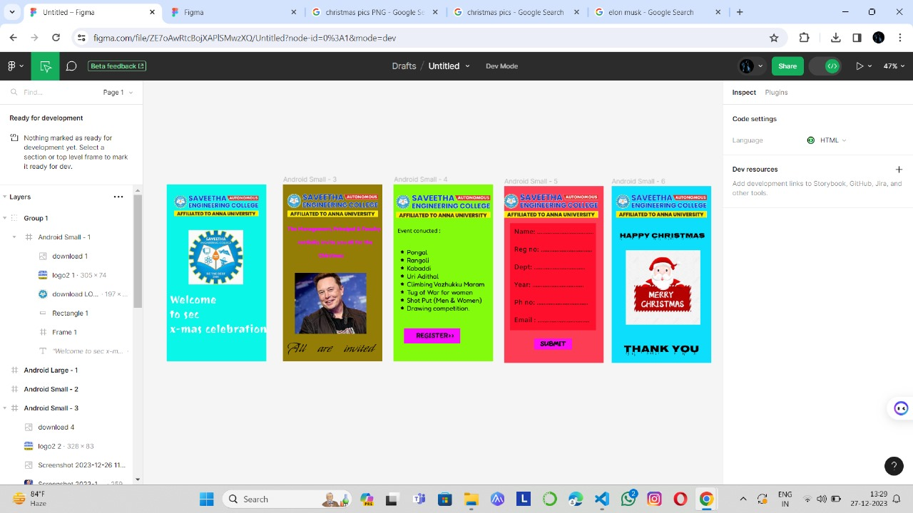

# Ex09 Event Registration Web Application
## Date:25.12.2023

## AIM:
To design, develop and deploy a web application for event registration.

## DESIGN STEPS:

### Step 1:
Create a new frame.

### Step 2:
Select any one preset size of your choice.

### Step 3:
Select the shapes you need.

### Step 4:
Import images as needed.

### Step 5:
Create pages based on your need and link them.

### Step 6:

Validate the HTML and CSS code.

### Step 6:

Publish the website in the given URL.

## DESIGN TOOL:
Figma

## CODE:
```

home page
<div style="width: 100%; height: 100%; position: relative; background: #0AF6E8; flex-direction: column; justify-content: flex-start; align-items: flex-start; display: inline-flex">
    <div style="width: 100px; height: 100px; position: relative"></div>
    
    
    <div style="width: 419px; height: 225px; color: white; font-size: 40px; font-family: Joti One; font-weight: 400; word-wrap: break-word">Welcome <br/>to sec<br/>x-mas celebration<br/></div>
</div>
---
// Welcome <br/>to sec<br/>x-mas celebration<br/>
color: white;
 font-size: 40px;
 font-family: Joti One;
 font-weight: 400;
 word-wrap: break-word

 2nd page

 <div style="width: 100%; height: 100%; position: relative; background: #947D07">
    
    
    <div style="width: 368px; height: 191px; left: 16px; top: 149px; position: absolute; color: #F90DFE; font-size: 20px; font-family: Fredoka; font-weight: 700; word-wrap: break-word">The Management, Principal & Faculty<br/><br/>        cordially invite you all for the <br/>          <br/>                        Chirstmas<br/></div>
    <div style="width: 335px; height: 66px; left: 16px; top: 559px; position: absolute; color: black; font-size: 48px; font-family: My Soul; font-weight: 400; word-wrap: break-word">All   are   invited</div>
</div>
// The Management, Principal & Faculty<br/><br/>        cordially invite you all for the <br/>          <br/>                        Chirstmas<br/>
color: #F90DFE;
 font-size: 20px;
 font-family: Fredoka;
 font-weight: 700;
 word-wrap: break-word
---
// All   are   invited
color: black;
 font-size: 48px;
 font-family: My Soul;
 font-weight: 400;
 word-wrap: break-word

 3rd page 

 <div style="width: 100%; height: 100%; position: relative; background: #83FB0C">
    
    <div style="left: 15px; top: 157px; position: absolute; color: black; font-size: 20px; font-family: Nokora; font-weight: 400; word-wrap: break-word">Event conucted :</div>
    <div style="left: 48px; top: 231px; position: absolute; color: black; font-size: 24px; font-family: Fredoka; font-weight: 400; word-wrap: break-word">Pongal <br/>Rangoli<br/>Kabaddi<br/>Uri Adithal <br/>Climbing Vazhukku Maram <br/>Tug of War for women <br/>Shot Put (Men & Women)<br/>Drawing competition.</div>
    <div style="width: 203px; height: 55px; left: 38px; top: 521px; position: absolute; background: #F90DFE"></div>
    <div style="left: 82px; top: 533px; position: absolute; color: black; font-size: 24px; font-family: Fuzzy Bubbles; font-weight: 400; word-wrap: break-word">REGISTER>> </div>
    <div style="width: 26px; height: 229px; left: 26px; top: 234px; position: absolute; color: black; font-size: 24px; font-family: Fredoka One; font-weight: 400; word-wrap: break-word">*<br/>*<br/>*<br/>*<br/>*<br/>*<br/>*<br/>*</div>
</div>
// Event conucted :
color: black;
 font-size: 20px;
 font-family: Nokora;
 font-weight: 400;
 word-wrap: break-word
---
// Pongal <br/>Rangoli<br/>Kabaddi<br/>Uri Adithal <br/>Climbing Vazhukku Maram <br/>Tug of War for women <br/>Shot Put (Men & Women)<br/>Drawing competition.
color: black;
 font-size: 24px;
 font-family: Fredoka;
 font-weight: 400;
 word-wrap: break-word
---
// REGISTER>> 
color: black;
 font-size: 24px;
 font-family: Fuzzy Bubbles;
 font-weight: 400;
 word-wrap: break-word
---
// *<br/>*<br/>*<br/>*<br/>*<br/>*<br/>*<br/>*
color: black;
 font-size: 24px;
 font-family: Fredoka One;
 font-weight: 400;
 word-wrap: break-word
 
  4th page

<div style="width: 100%; height: 100%; position: relative; background: rgba(255, 0, 30.60, 0.75)">
    
    <div style="left: 281px; top: 282px; position: absolute; color: white; font-size: 24px; font-family: Fredoka One; font-weight: 400; word-wrap: break-word"><br/></div>
    <div style="width: 311px; height: 388px; left: 21px; top: 134px; position: absolute; background: rgba(255, 0, 30.60, 0.75)"></div>
    <div style="left: 36px; top: 151px; position: absolute; color: #120202; font-size: 24px; font-family: Amiko; font-weight: 400; word-wrap: break-word">Name: .................................<br/><br/>Reg no: ..............................<br/><br/>Dept: ..............................<br/><br/>Year: ..............................<br/><br/>Ph no: ..............................<br/><br/>Email : ..............................<br/></div>
    <div style="width: 138px; height: 40px; left: 108px; top: 552px; position: absolute; background: #FE0DF4"></div>
    <div style="left: 131px; top: 557px; position: absolute; color: black; font-size: 24px; font-family: Fuzzy Bubbles; font-weight: 400; word-wrap: break-word">SUBMIT</div>
</div>
// <br/>
color: white;
 font-size: 24px;
 font-family: Fredoka One;
 font-weight: 400;
 word-wrap: break-word
---
// Name: .................................<br/><br/>Reg no: ..............................<br/><br/>Dept: ..............................<br/><br/>Year: ..............................<br/><br/>Ph no: ..............................<br/><br/>Email : ..............................<br/>
color: #120202;
 font-size: 24px;
 font-family: Amiko;
 font-weight: 400;
 word-wrap: break-word
---
// SUBMIT
color: black;
 font-size: 24px;
 font-family: Fuzzy Bubbles;
 font-weight: 400;
 word-wrap: break-word

 5th page

 <div style="width: 100%; height: 100%; position: relative; background: #0CDEFB">
    
    <div style="left: 173px; top: 467px; position: absolute; color: black; font-size: 64px; font-family: Tourney; font-weight: 400; word-wrap: break-word">   </div>
    <div style="width: 331px; height: 49px; left: 29px; top: 161px; position: absolute; color: black; font-size: 24px; font-family: Nosifer Caps; font-weight: 800; word-wrap: break-word">HAPPY CHRISTMAS </div>
    <div style="left: 16px; top: 562px; position: absolute; color: black; font-size: 36px; font-family: Nosifer Caps; font-weight: 800; word-wrap: break-word">   Thank you </div>
    
</div>
//    
color: black;
 font-size: 64px;
 font-family: Tourney;
 font-weight: 400;
 word-wrap: break-word
---
// HAPPY CHRISTMAS 
color: black;
 font-size: 24px;
 font-family: Nosifer Caps;
 font-weight: 800;
 word-wrap: break-word
---
//    Thank you 
color: black;
 font-size: 36px;
 font-family: Nosifer Caps;
 font-weight: 800;
 word-wrap: break-word
 ```


## OUTPUT:


## RESULT:
The program to design, develop and deploy a web application for event registration is completed successfully.